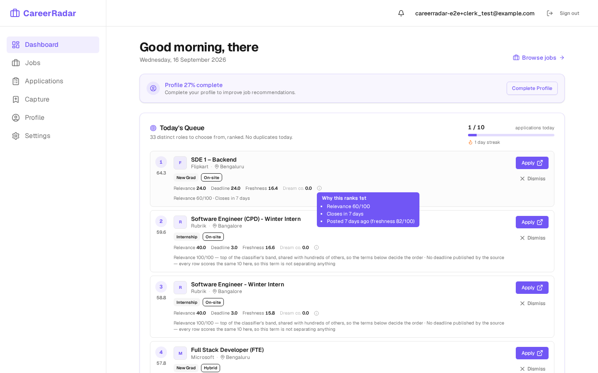
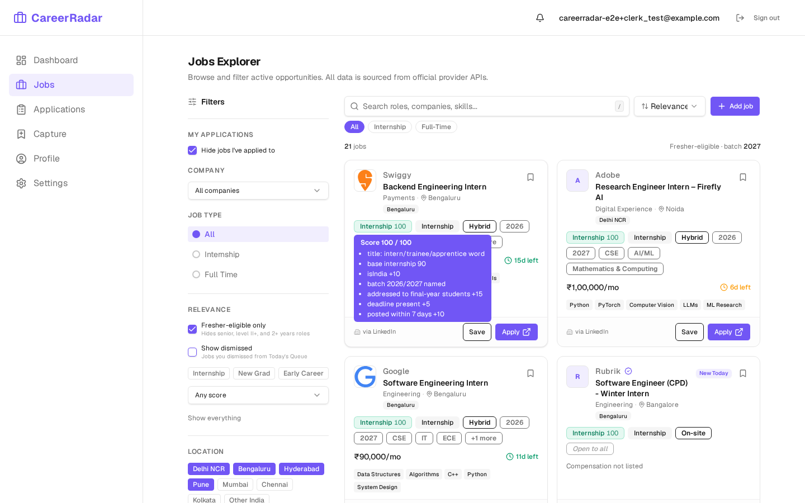
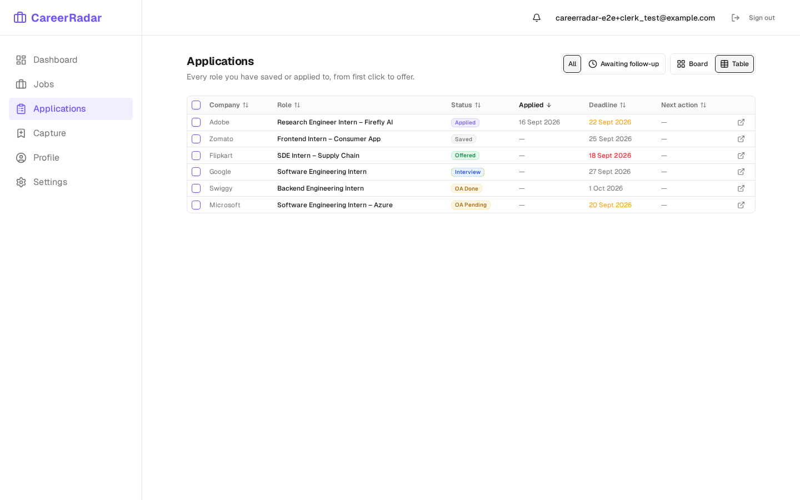
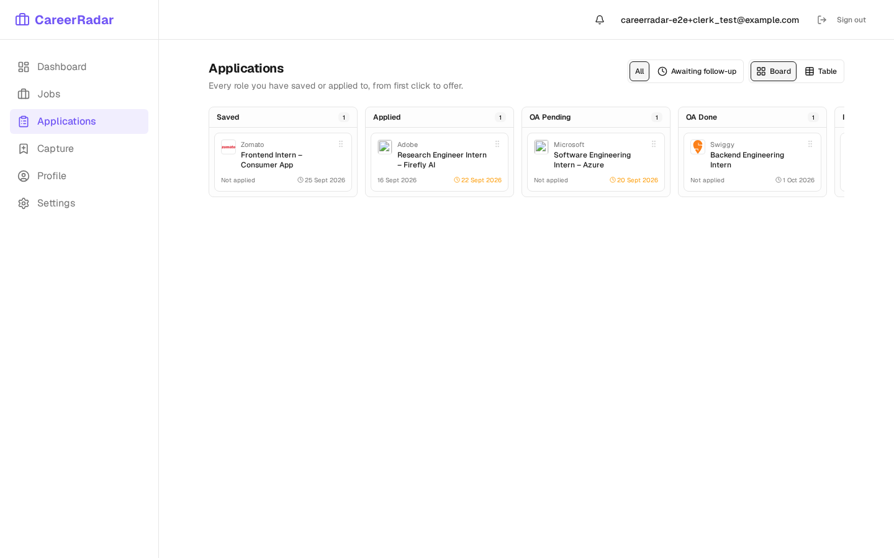
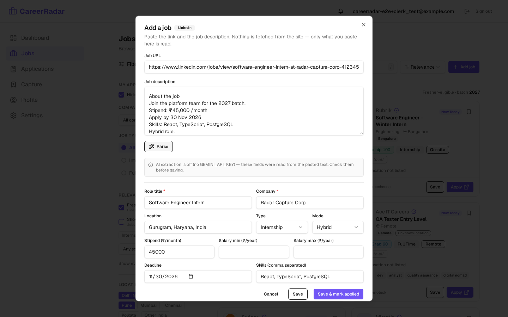
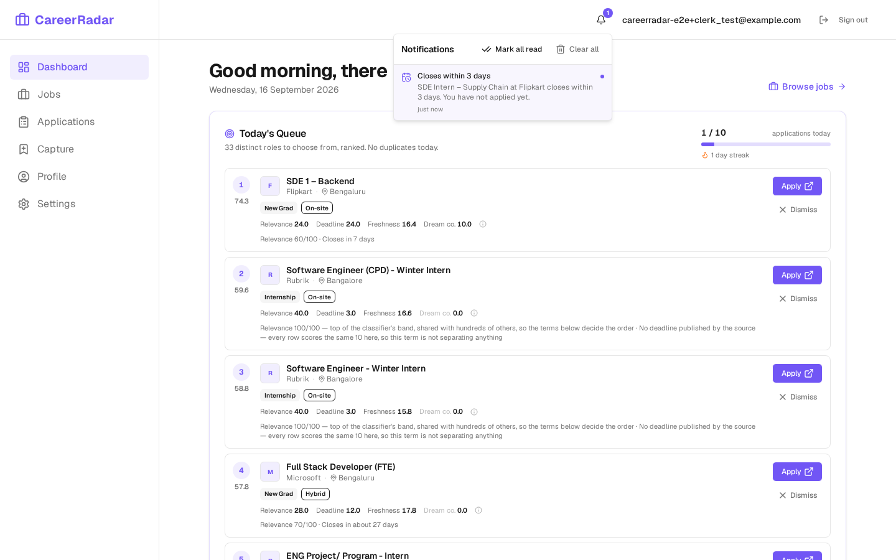
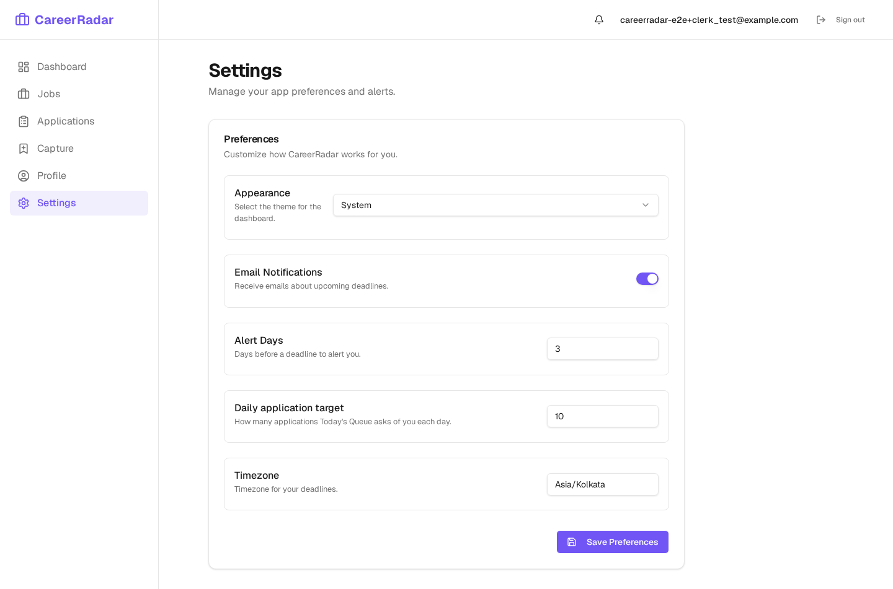
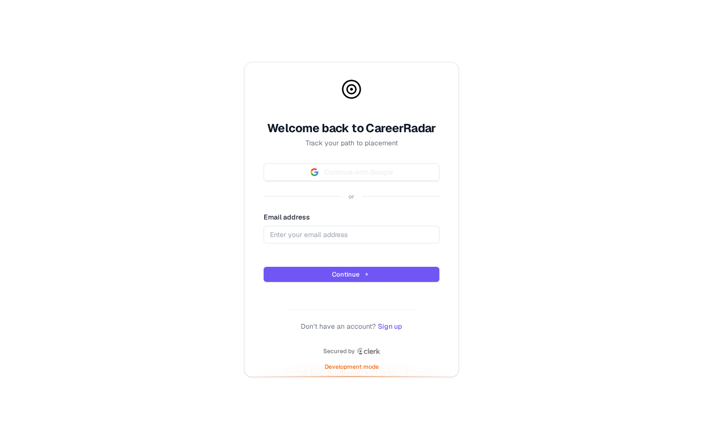
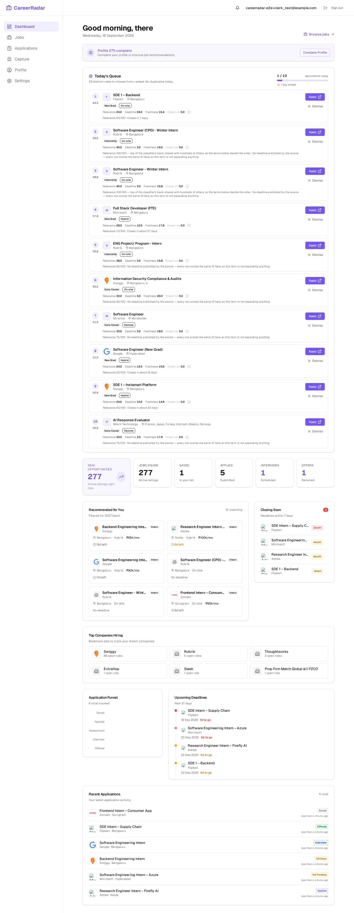
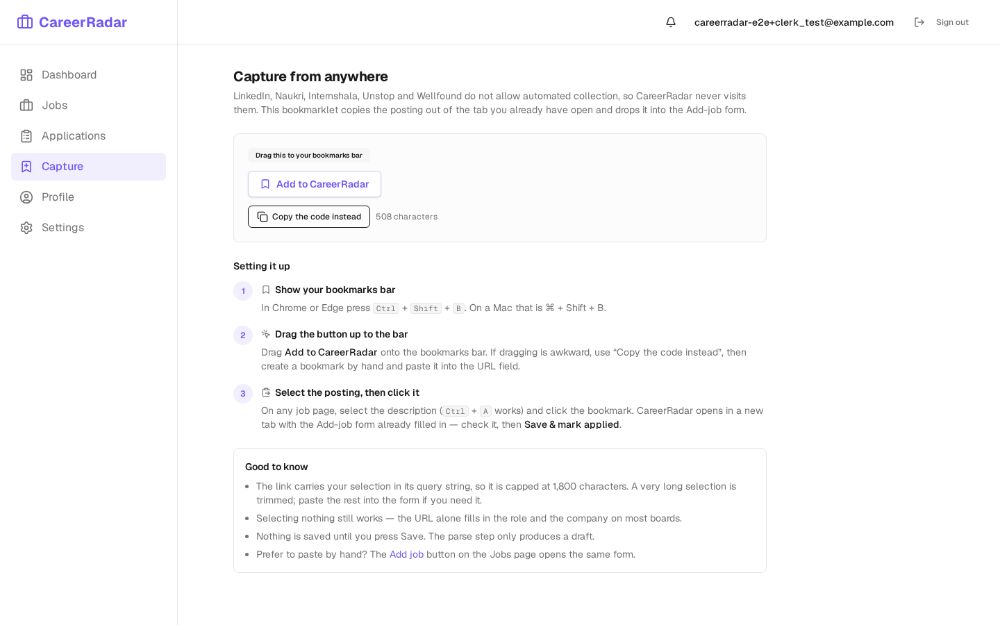

<div align="center">

# 🎯 CareerRadar

**A personal placement OS for an Indian CS student hunting SDE internships.**

It pulls postings from public ATS and job-board APIs, works out which of them a
final-year student can actually apply to, and every morning hands you ten of
them, ranked, with the reason for each rank.

[](https://github.com/UditSinghChauhan/CareerRadar/actions/workflows/ci.yml)
[](LICENSE)


[**Live demo**](https://careerradar-34ec.onrender.com/) ·
[**Architecture**](docs/architecture.md) ·
[**Engineering decisions**](#engineering-decisions) ·
[**Run it locally**](#run-it-locally)

</div>

---

## Today's Queue


The problem this solves is not "find job listings". It is that **4,512 active
postings, 2,109 of them plausibly for a fresher, is not something a person can
read every morning** — so whatever is at the top of the list is what actually
gets applied to, and everything below it may as well not exist.

So the ranking is the product. Each row carries its four priority components
and a plain-language reason for each, computed server-side, so you can see why
it is where it is rather than trusting a number.



*Numbers throughout this README were measured against the live database on
2026-09-16, not estimated.*

---

## What it does

**Ingestion**

- **14 providers registered, 47 of 95 company/provider configs enabled** —
  Greenhouse, Lever, Ashby, SmartRecruiters and Workday (authoritative
  per-employer listings), plus RemoteOK, Remotive, Adzuna, JSearch, Arbeitnow
  and Jobicy (aggregators). The disabled configs are boards that have gone
  quiet or 404'd; they stay in the table with a note rather than being deleted.
  4,995 rows from 1,513 companies so far.
- **Cron sync every six hours** via GitHub Actions, because Render's free tier
  has no cron and kills the in-process scheduler on spin-down. A boot-sync guard
  keeps a burst of cold starts from burning Adzuna's 250 req/day and JSearch's
  200 req/month.
- **Stale-job closing** — three separate sweeps, because "this posting is dead"
  means something different for an ATS (absent from today's complete listing)
  than for an aggregator (older than 45 days). Guarded so a provider outage can
  never be read as "this company closed everything".
- **Location normalization** — six columns out of the free-text string every
  provider emits, with NCR/MMR metro grouping and an explicit "unknown" state.
- **The relevance classifier** — sorts every posting into internship /
  new_grad / early_career / not_relevant and scores it 0–100.

**Using it**

- **Today's Queue** — ten ranked roles a day, duplicates collapsed, dismissals
  respected, with a per-row explanation and a daily target counter.
- **Applications tracker** — board and table views across
  saved → applied → OA → interview → offered, with referral/outreach tracking
  and an "awaiting follow-up" filter.
- **One-click apply** — opens the posting and logs the application in the same
  click, date stamped.
- **Paste-to-parse capture** — paste a job description, get a filled form.
  Works with **no API key**: Gemini is used when `GEMINI_API_KEY` is set, and
  deterministic heuristics otherwise, with the dialog saying which ran.
- **Search** — Postgres full-text over title, description, requirements and
  skills, server-side pagination, saved searches.
- **Notifications** — deadline reminders at 72h and 24h, new-job alerts against
  saved searches, deduplicated so six-hourly passes do not repeat themselves.
- **AI match scores** — a 0–100 fit score on the card and, in the application
  drawer, the skills this posting wants that your profile does not show. Scores
  are computed once and stored, so opening the same job again costs nothing;
  a nightly batch scores the top 50 unscored roles by relevance. Optional
  everywhere: with no `GEMINI_API_KEY` the badge and the block are simply
  absent.

<table>
<tr>
<td width="50%"><p align="center"><em>Jobs Explorer — relevance, location and batch filters</em></p></td>
<td width="50%"><p align="center"><em>Every score shows the signals that produced it</em></p></td>
</tr>
<tr>
<td><p align="center"><em>Applications tracker</em></p></td>
<td><p align="center"><em>…and as a board</em></p></td>
</tr>
<tr>
<td><p align="center"><em>Paste-to-parse — no API key required</em></p></td>
<td><p align="center"><em>Deadline reminders</em></p></td>
</tr>
<tr>
<td><p align="center"><em>Profile — the graduation year drives batch matching</em></p></td>
<td><p align="center"><em>Settings — daily target and timezone</em></p></td>
</tr>
</table>

<details>
<summary>More screenshots</summary>

| | |
| --- | --- |
| Landing |  |
| Sign in |  |
| Full dashboard |  |
| Bookmarklet installer |  |

Regenerate them all with:

```bash
CAPTURE_SCREENSHOTS=1 pnpm run test:e2e e2e/screenshots.spec.ts
```

</details>

---

## Engineering decisions

Three pieces where the interesting part is *why*, not *what*.

### Decision 1 — the relevance classifier

**`artifacts/api-server/src/relevance/classifier.ts`**

Sorting 4,512 postings into "a final-year student can apply to this" and "they
cannot" is the whole value of the app, and it is done with **deterministic
rules and no LLM**. That is the first decision, and it was not about cost: the
same input must always produce the same output, because the backfill recomputes
every row on every run. A model that answers slightly differently the second
time makes the score meaningless as a sort key and makes the tests untestable.

**Two signals, neither sufficient.** The provider's `jobType` and the job title
disagree often enough to be interesting. The counts below are the measurement
the rules were built from, over the active table on 2026-09-15 (the table has
since grown; the proportions have not moved):

| | rows |
| --- | --- |
| `job_type = 'internship'` | 956 |
| whole-word title match (`intern`/`trainee`/`apprentice`/`co-op`) | 913 |
| both | 875 |
| **jobType only, no title match** | **81** |

Those 81 are the whole problem in miniature. Some are genuine: Lever's
`commitment`, Ashby's `employmentType` and JSearch's `job_employment_type`
carry "Intern" for titles that do not, like "Software engineering internAI
India". But **64 of the 81 are a substring bug** — the old `inferJobType` used
`title.includes("intern")`, which matched *Internal* Audit Manager and
*International* Voice Process. The provider's jobType was not a second opinion;
it was that bug echoing back.

So: every title regex is word-bounded, and a provider `jobType` of
`internship` is ignored when the title's only "intern" is inside
`internal` / `international` / `internet` — with a signal saying so.

**The rules, in priority order.** Order is the design:

1. A whole-word `intern`/`trainee`/`apprentice`/`co-op` **title** →
   `internship`, even when the title also says Senior. "Senior Software
   Engineer Intern" is an internship at a company that has senior engineers.
2. Seniority, roman level II+, role level 2+, or `experienceMin ≥ 2` →
   `not_relevant`, score 0.
3. Untainted provider `jobType: internship` → `internship`.
4. New-grad markers in the title → `new_grad`. Markers in the *description*
   count too, but only when the title names an engineering role — otherwise
   "Office Maid, freshers welcome" becomes a new-grad SDE opening.
5. No seniority, ≤ 2 years or unstated, engineering role noun → `early_career`.
6. Everything else → `not_relevant`.

**The scoring modifiers that were added to the spec.** The spec's modifiers
(`isIndia +10`, `isRemote +5`, batch match `+10`, deadline `+5`, fresh `+10`,
old `−20`, batch mismatch `−40`) produce a table where "International Process
Associate" internships and a Maryland SDE internship both tie an India SDE
internship at the 100 cap. Three more were added because the ranking has to
survive the real data: no engineering role noun in the title `−15`, an
explicitly non-technical title `−20`, and an on-site posting scoped outside
India `−25`. `isIndia: null` is never penalised — unknown stays reviewable.

**Batch text is usually inclusive of the user, and naive parsing gets this
badly wrong.** The `−40` batch-mismatch penalty fired on 71 live rows. Reading
them one by one:

- *"2026 freshers & final-year students"* names 2026 but is addressed to
  whoever is in their final year **now** — which in September 2026 is the 2027
  batch. `final-year student` is therefore `+15`, above a generic match,
  anchored to the academic calendar (June–May).
- *"2025 or later"*, *"2025 onwards"*, *"2025+"* is an open-ended lower bound,
  not a single year.
- *"2025-2028"* is a range covering every year in it, not just the ends.
- *"pursuing"* means current students are welcome, so a named year stops
  penalising — **unless** the year carries "only" (*"2026 Graduates Only"*),
  where an explicit restriction beats boilerplate.
- *"© 2026 Dlytica"*, *"Top Employer 2026"*, *"Named a 2025 Gartner Magic
  Quadrant"* and *"Walk-in interview on 24th Aug 2026"* are **not batch years
  at all**, and all four were sitting in the `−40` bucket. A year now only
  counts as a batch when something batch-shaped appears within 60 characters,
  and calendar-date context disqualifies it outright.

Every modifier that fires is named in `relevanceSignals`, which is what the UI
shows on hover. The score is never a black box.

**The test strategy** is the reason any of that is safe to change.
`classifier.test.ts` is ~750 lines and none of it mocks anything, because there
is nothing to mock — the classifier is a pure function. The suite is built
around four ideas:

1. **Every rule has a test that fails if the priority order changes.** The
   canonical one is `"Senior Software Engineer Intern" → internship`: it exists
   specifically to break if someone "fixes" the seniority rule to run first.
2. **Every bug found in live data became a case, quoted verbatim.** "Internal
   Audit Manager", "International Voice Process", "© 2026 Dlytica", "Walk in
   interview on 24th Aug 2026", "2026 freshers & final-year student". The
   regression suite *is* the list of things the live table taught us.
3. **Scores are asserted as component arithmetic, not as magic totals.** Tests
   assert which signals fired and that the modifiers sum correctly, so adding a
   modifier does not require rewriting forty expected numbers — a suite that is
   painful to update is a suite that gets weakened.
4. **The clock is injected.** `now` is a parameter, so the recency modifiers
   and the final-year-batch calendar are tested at fixed instants instead of
   being quietly time-dependent.

Beyond the unit suite, `e2e/relevance.spec.ts` drives the real filters in a
browser against real rows, so a classifier change that breaks the Jobs page's
relevance filter fails before it merges.

### Decision 2 — the location normalizer, and why `jobs.country` is unreliable

**`artifacts/api-server/src/relevance/location.ts`**

There is a `country` column on `jobs`. The normalizer refuses to read it. That
is worth explaining, because "use the column that already holds the answer" is
the obvious move.

**Why the column cannot be trusted.** Two independent failures:

1. **It has a schema default.** When a provider omits the field, the default
   applies — so every RemoteOK row reads `'India'`, including the ones for
   Toronto and Austin. The column does not distinguish "the provider said
   India" from "the provider said nothing".
2. **Providers that do populate it disagree about format.** SmartRecruiters
   writes lowercase ISO-2. Others write full names. Some write a region.

A column that is *confidently wrong* is worse than one that is empty, because
nothing downstream can tell the two apart. So the only country input the
normalizer accepts is `providerCountry` — the value **this** provider emitted
for **this** job in **this** run, passed in explicitly. The backfill passes
nothing at all, and re-derives everything from the location string.

**What the location string actually looks like** (sampled live, 2026-09-14):

| Provider | Shapes seen |
| --- | --- |
| Adzuna (largest source) | `India` (31% — bare country), `Bangalore, Karnataka`, `Noida, Ghaziabad`, `Palwal, Faridabad`, `Kochi, Ernakulam`, `Devanahalli, Bangalore Rural` |
| SmartRecruiters | `Mumbai, MH`, `New Delhi, DL`, `TG`, `Nassau, ` |
| RemoteOK | `Worldwide`, `Toronto, `, `Remote - US`, `Orem, UT`, `Austin, Austin, Texas, United States`, Arabic script |
| Remotive | `LATAM, Europe, USA, Canada, APAC` |
| Lever | `allLocations` joined — `Bengaluru, Pune` |

Two consequences fall out of that table. The second token is frequently a
**district**, not a state — `Noida, Ghaziabad`, `Kochi, Ernakulam` — so
districts get their own lookup table rather than being fed to the state
matcher. And `TN` is Tamil Nadu unless the surrounding string has already
established the US, where it is Tennessee, so state abbreviations are resolved
after a first pass over unambiguous tokens rather than in isolation.

**Rule 6 is the one that matters.** A string the module cannot place gets
`isIndia: null` — **never `false`**. `false` is reserved for strings that
actively name somewhere else. 282 active rows sit in that bucket today, and
they stay visible under "Unknown location" so they can be reviewed by hand. The
alternative — defaulting unknown to "not India" — silently deletes exactly the
postings whose location format nobody has seen before, which is the set most
likely to contain something new and worth applying to.

Tested the same way as the classifier: pure function, ~670 lines of cases, each
malformed string above quoted verbatim from the source that produced it, plus
`e2e/location.spec.ts` driving the real location filters in a browser.

### Decision 3 — the queue's day-seeded rotation

**`artifacts/api-server/src/queue/priority.ts`**

The queue looked fine and was quietly broken, and the measurement that showed
it is the most useful thing in this repository.

**The four components produce a real spread — and almost none at the top.**
Measured on 2026-09-15, across 1,549 eligible rows, there were 163 distinct
priority values. But every one of the top ten scored an **identical 63.00**,
and fifteen rows tied there. Pulling the components apart explains why:

| Component | Weight | What it actually did |
| --- | --- | --- |
| `relevanceScore` | 0.40 | **Saturated.** 620 of those 1,549 rows scored exactly 100 — the modifiers cap there (719 of 2,109 today). Inside that band it contributes an identical 40.0 to every row and separates nothing. |
| `deadlineUrgency` | 0.30 | **Inert.** `deadline` is populated on **13 rows of 4,995** and on **zero** fresher-eligible ones — still zero today — because the ATS and aggregator APIs in use do not publish application deadlines. Every row scores the spec's "10 if none" → a constant 3.0. |
| `freshness` | 0.20 | The only component separating inside the saturated band — and it does so genuinely. |
| `dreamCompanyBoost` | 0.10 | Zero until the user bookmarks something. |

The deadline component is kept, weighted exactly as specified, and **every
row's reason string names its absence** — "No deadline published by the source
— every row scores the same 10 here, so this term is not separating anything".
A component that looks like it is working but is not is worse than one that is
visibly idle, and it starts doing real work the moment a provider with
deadlines or a manual capture lands.

**The part that was actually broken.** With the spec's ordering alone, a tie
falls through to `posted_date DESC, id`. That is not a tie-break, it is a
freeze — because **freshness is a monotone function of `posted_date`**. It can
never *reorder* two rows; it can only scale the gap between them. Whatever is
newest today was newest yesterday and will be newest tomorrow.

Running the real query against the live table with the clock advanced 1, 2, 3,
5, 7 and 14 days returned **the same ten rows every time. 100% overlap at every
horizon.** The ranking contributed exactly zero turnover.

Ingestion does refresh the head in practice — 30–70 eligible rows arrive a day
— but the consequence stands: of the 620 rows sitting at relevance 100, the
**~610 that were not currently the newest were unreachable forever**, despite
being exactly as relevant as the ten being shown. The app was asking its one
user to apply to the same ten jobs until they aged out.

**The fix is a deterministic per-day shuffle inserted *between*
`priority DESC` and `posted_date DESC, id`:**

```sql
ORDER BY priority DESC,
         md5(jobs.id::text || :queueDay),   -- ← the rotation
         posted_date DESC NULLS LAST,
         id
```

It is a **tie-break, not a reordering**. It can only ever change the relative
order of rows whose priority is byte-identical, so the specified ranking is
preserved exactly — a row at 63.00 can never jump one at 63.01. Seeded by
`(job id, queue day)` so that:

- **within a day the queue is stable** — refreshing returns the same ten, which
  the spec requires ("dismissing removes it and it does not return");
- **across days the tied block rotates**, so the long tail becomes reachable;
- **it needs no stored state**, which matters on an instance that restarts
  whenever it spins down.

The day boundary is the **user's** day, not UTC. Seeded on the UTC date the
shuffle would change at 05:30 every morning in `Asia/Kolkata` — the middle of
the hour someone actually works through — replacing the ten rows they were
partway through applying to. On the local date it changes at local midnight.

`md5` is used as a cheap stable hash available in both Postgres and Node with
no extension, and `daily-queue.test.ts` asserts that Postgres's `md5()` and
Node's agree for the same input — the same lockstep check that keeps the SQL
and TypeScript versions of the priority formula from drifting apart.

---

## Architecture

```
provider → normalizer → location → classifier → dedup → upsert
                                                           │
                       staleness sweep ←───────────────────┘
                              │
                       queue ranking → GET /api/dashboard/today
```

The full walkthrough — each stage, what it guards against, and the request
path, testing and deployment model — is in
[**docs/architecture.md**](docs/architecture.md).

Two invariants worth stating here because they shape everything else:

- **The API contract is generated, never hand-written.**
  `lib/api-spec/openapi.yaml` → orval → Zod validators + React Query hooks.
  A new endpoint goes into the YAML first; nothing under `generated/` is edited.
- **Schema changes are additive only and ship separately from code.** Render
  deploys code on merge; nothing deploys schema. A boot-time drift check
  compares every declared column against `information_schema` and turns
  `/api/health` **503** with the exact missing columns if a migration has not
  landed — because twice the code reached production before its columns did and
  every `/api/jobs` request 500'd behind a green health check.

### Health

```bash
curl -s 'https://careerradar-34ec.onrender.com/api/health'
# {"ok":true,"status":"running","schema":"ok"}

curl -s 'https://careerradar-34ec.onrender.com/api/health?detail=1' | jq .sync
# {
#   "status": "ok",
#   "lastSyncAt": "2026-09-16T05:35:24.730Z",
#   "lastRunAt": "2026-09-16T05:36:21.624Z",
#   "lastSyncAgeSeconds": 2136,
#   "fresh": true,
#   "staleAfterSeconds": 43200,
#   "scheduler": { "enabled": true, "intervalMs": 21600000, "running": false,
#                  "runsThisProcess": 0, "lastRunAt": null, "nextRunAt": null },
#   "providers": [
#     { "name": "adzuna", "displayName": "Adzuna India", "state": "ok",
#       "configuredCompanies": 1,
#       "lastRunAt": "2026-09-16T05:35:24.730Z",
#       "lastSuccessAt": "2026-09-16T05:35:24.730Z",
#       "runs24h": 4, "failures24h": 0,
#       "jobsInserted24h": 37, "jobsUpdated24h": 112, "lastError": null },
#     ...
#   ]
# }

# The default body is unchanged and stays cheap — 2.8 ms against a warm local
# server, versus 35 ms with ?detail=1, which is why detail is opt-in.
```

`?detail=1` reads `provider_sync_logs`, not in-memory counters — on a free
instance that spins down every 15 minutes, the process answering a health check
is usually one that booted seconds ago, and its in-memory metrics read zero for
a service that is syncing perfectly well. Per-provider `state` is one of `ok`,
`stale`, `failing`, `never_run` or `disabled`.

---

## Tech stack

| Layer | |
| --- | --- |
| Frontend | React 18, Vite, Wouter, TanStack Query, Radix UI + shadcn/ui, Tailwind CSS v4 |
| Backend | Express 5, Node 22, TypeScript 5.9 |
| Database | PostgreSQL 16, Drizzle ORM (never Prisma) |
| Auth | Clerk — **session cookies**, no bearer tokens in browser code |
| AI | Google Gemini, optional everywhere it appears |
| Contract | OpenAPI 3.1 → orval → Zod validators + React Query hooks |
| Tests | Vitest, PGlite (Postgres in WASM), Playwright |
| CI/CD | GitHub Actions, Render |

---

## Run it locally

Needs Node 22+, pnpm 9+, a PostgreSQL 16 database and a free Clerk
development instance.

```bash
git clone https://github.com/UditSinghChauhan/CareerRadar.git
cd CareerRadar
pnpm install
cp .env.example .env          # fill in DATABASE_URL and the Clerk keys

pnpm --filter @workspace/db run push        # schema → local database only
pnpm --filter @workspace/api-server run seed

pnpm --filter @workspace/api-server run dev    # :8080
pnpm --filter @workspace/career-radar run dev  # :5173
```

Interactive API docs at `http://localhost:8080/api/docs`.

Everything optional stays optional: with no `GEMINI_API_KEY` the AI endpoints
report unavailable and the UI hides them, and paste-to-parse falls back to its
heuristics; with no `ADZUNA_*` or `JSEARCH_API_KEY` those two providers are
skipped and the other seven enabled ones run. `.env.example` documents every
variable and which feature goes quiet without it.

### Verification

```bash
pnpm run typecheck:libs   # always first — stale .tsbuildinfo causes phantom errors
pnpm run typecheck
pnpm run lint
pnpm run test             # 941 unit tests
pnpm run build
pnpm run test:e2e         # 10 Playwright specs, needs a local DB + Clerk dev keys
```

---

## A note on what this does not do

`internshala/provider.ts`, `unstop/provider.ts` and `wellfound/provider.ts` are
**deliberate no-op stubs that return `[]`**. Those sites' Terms of Service and
`robots.txt` prohibit automated extraction, so there is no scraper, no headless
browser and no proxy fetch — for them or for LinkedIn or Naukri. The paste-based
capture feature exists because it is the legitimate way to get a posting from a
site that does not want to be crawled: you open it yourself, you copy it, the
app parses what you pasted and fetches nothing.

---

## What I'd do next

In rough order of how much they would change the daily experience:

1. **Repair the ingest identity so duplicates never land.** The queue collapses
   them at read time by `(company, normalised title)`, which is the safe half of
   the fix. The cause is that Adzuna's `source_url` carries a per-response
   session token, so `sourcePlatform + sourceUrl` is different on every sync for
   the same advert — six rows, six URLs, one job. Hashing the stable ad id out
   of the URL fixes it at the source, but it rewrites the upsert identity for
   every existing row, so it needs a careful backfill rather than a one-line
   change.
2. **Get real deadlines into the table.** 13 rows out of 4,995 have one, which
   makes a 30%-weighted component inert and means "closing soon" can only ever
   describe a handful of postings. Career-page scraping is out on ToS grounds;
   the realistic paths are providers that do publish deadlines and the
   paste-capture flow, which already parses "Apply by 30 Nov 2026".
3. **A relevance score with more resolution at the top.** 719 of today's 2,109
   eligible rows tie at exactly 100 and the rotation exists to work around that. Skill overlap
   against the profile would break the tie on something meaningful rather than
   on a hash — the AI matching service already computes exactly this, and since
   Phase 8 it stores the answer in `job_match_scores`, so folding it in as a
   small, optional modifier is now a read rather than a request.
4. **Email digests.** The notification bell only works if you open the app;
   the whole point is the days you do not.
5. **A production Clerk instance.** The live deployment runs on a development
   instance, which has a user cap and needs DNS on a domain an `onrender.com`
   subdomain cannot provide. Fine for one user, a hard stop for sharing it.

---

## License

MIT © [Udit Singh Chauhan](https://github.com/UditSinghChauhan)
